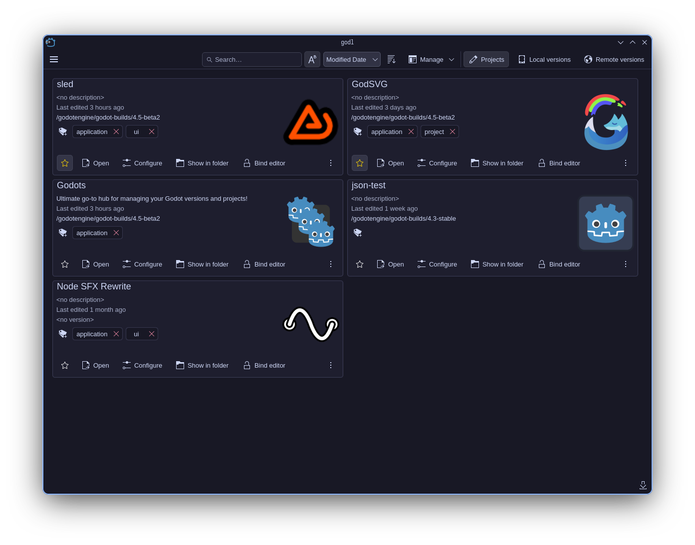
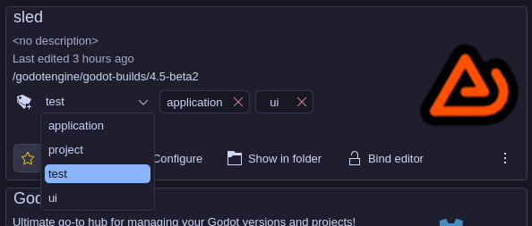
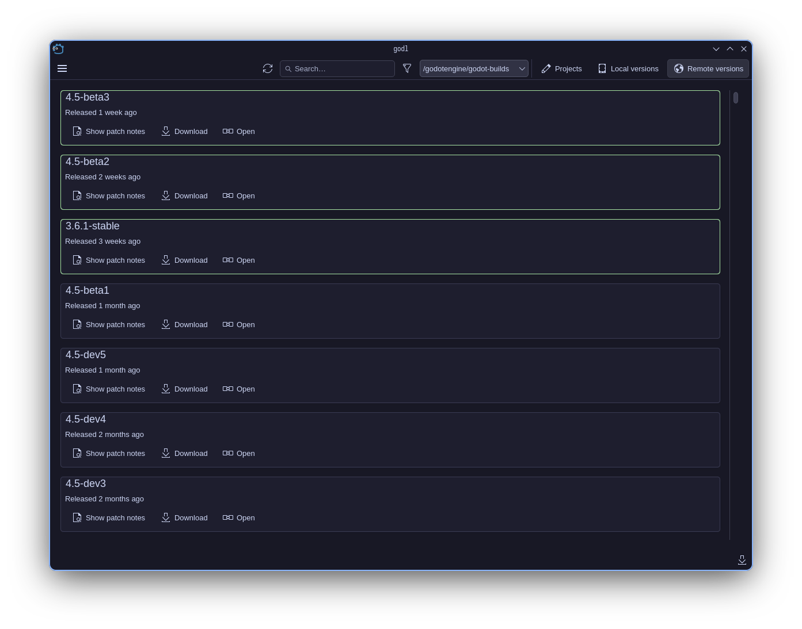
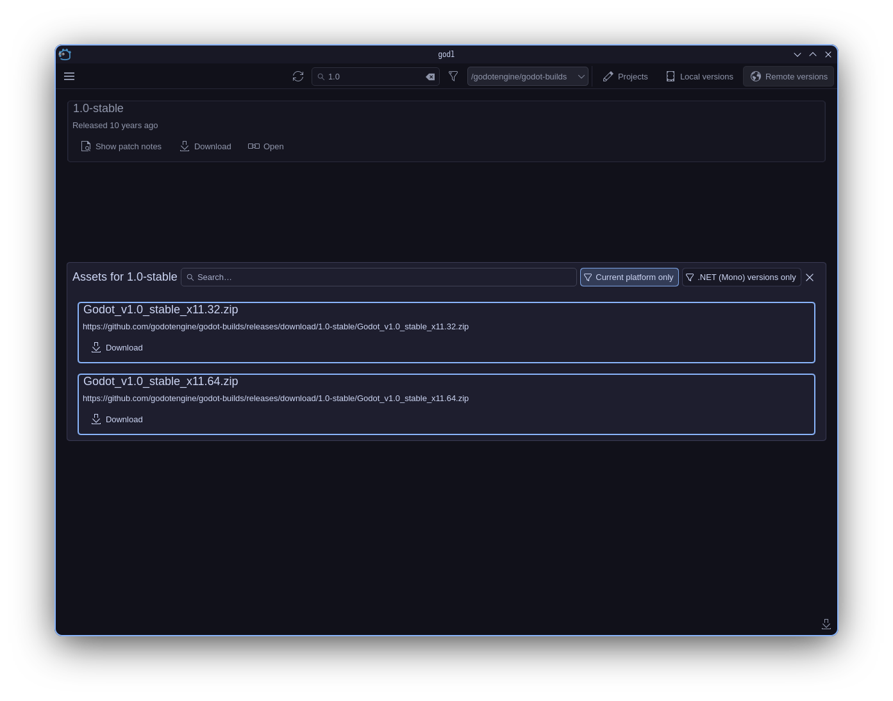
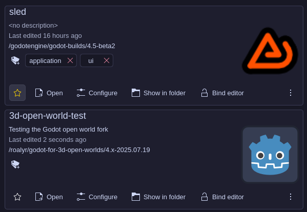
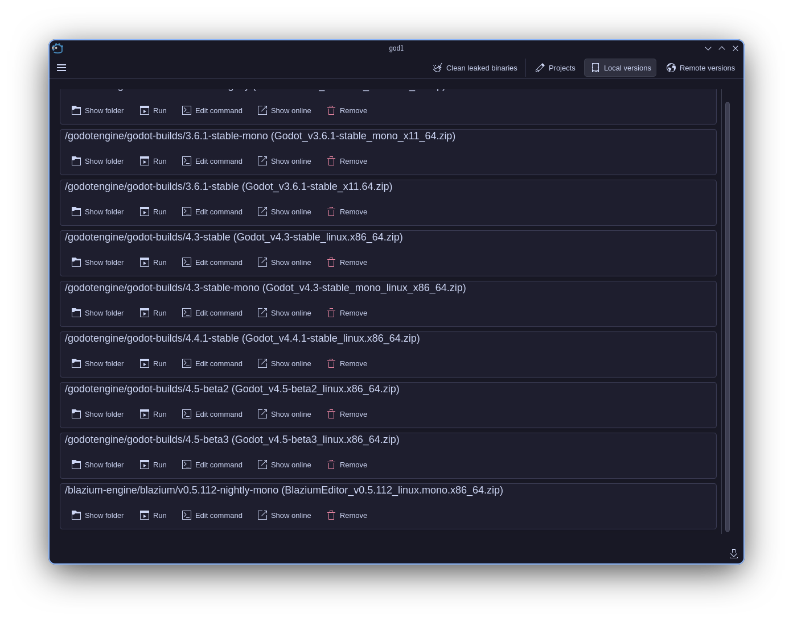
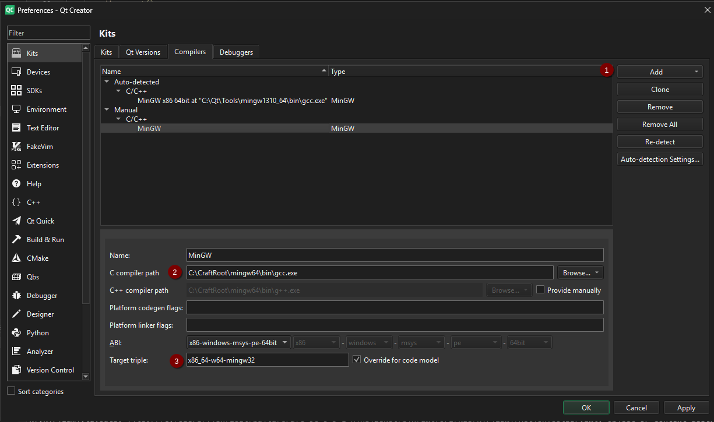
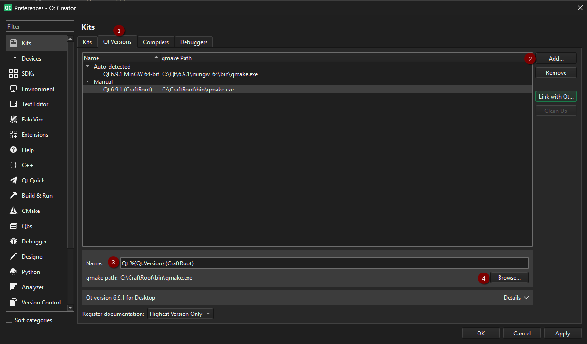
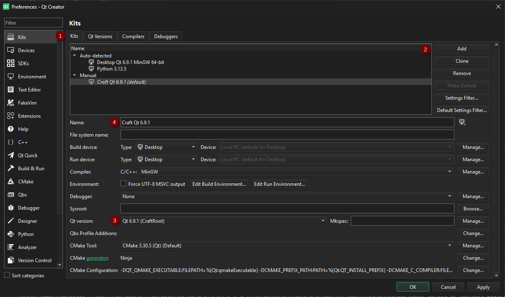
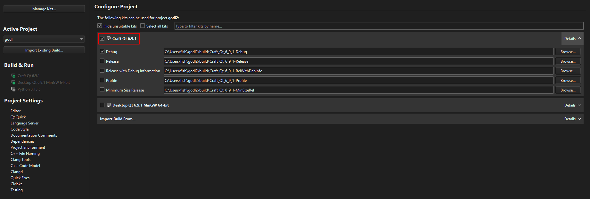

# godl

[yeah yeah just skip to the installation](#installation-instructions)

<p align=center>
    
</p>

A version manager for Godot, written in QML/C++ with the Qt Quick libraries.



## It lets you manage...

...your projects, including adding tags with a fancy interface:



*(you can also type arbitrary tags into the
combobox)*

...your versions:




...including first-class support for forks:


*(note: I am in no way endorsing Blazium — they just happened to be a convenient
fork)*

...your local versions:



...and finally, your sanity!

## Windows build?

There is a Windows build and I think it works pretty well. However, most of my
testing is on Linux, so please file bugs if you find them! I've got a Windows VM
(it's how I built it for Windows after all...) so I can probably fix bugs.

## Installation instructions

### Windows

Download the latest release zip from the releases section, extract it, and run
`godl.exe` (might be just `godl` if you've got file extensions turned off).
If you want, you can then also right-click the executable, select "Create Shortcut,"
and then copy it to `C:\ProgramData\Microsoft\Windows\Start Menu\Programs`
(you'll need administrator rights to do this).

### Linux

You'll need to install these dependencies (at least — I haven't tried running it
on a non-Plasma desktop, so this is just what I got from ldd)

- kdeclarative
- breeze-icons
- kirigami

Then, you should be able to download, extract, and run the executable.

## Building from source

### Building on Windows

pre-build requisites:

- git
- Qt Creator, installed through the [Qt Online installer](https://www.qt.io/download-qt-installer-oss)
  - It does ask for you to make an account, it's really annoying, but QtC is the
  easiest way I've found 😔
- CMake & Ninja, which you can also install through the Qt Online installer
  - I'm pretty sure you don't actually need any Qt binaries from the installer,
  since we'll be building those ourselves with Craft
- rcedit, which you can get through winget: `winget install rcedit`

To be honest I'm not entirely sure how I got it building on Windows.
But basically,

1. Install [KDE Craft](https://community.kde.org/Get_Involved/development/Windows)
2. Make sure you've activated the craft environment!
3. Set the Qt version to 6.9.1 if it's still at 6.8.3 with
`craft --set version=6.9.1 libs/qt6`
4. Install libs/qt6 with
`craft libs/qt6 kirigami kirigami-addons extra-cmake-modules karchive kiconthemes
kconfigwidgets qqc2-desktop-style qqc2-breeze-style`, and make sure to set MinGW
as the default compiler, not MSVC
5. Open Qt Creator, go to Preferences > Kits > Compilers, click add, then set up
the C compiler path to be the one you installed through Craft. It's normally at
"C:\CraftRoot\mingw64\bin\gcc.exe". Then, set the target triple to
"x86_64-w64-mingw32" (probably — I have no idea what this is/does).

6. Go to Qt Versions, click add, name it "Qt %{Qt:Version} (CraftRoot)", and set
the qmake path to the Craft qmake path (normally "C:\CraftRoot\bin\qmake.exe").

7. Go to Kits (the tab), click add, name it "Craft Qt", and set the Qt version
to be the Craft version you just added. Set the name to be "Craft Qt"

8. Clone the repository with git: `git clone https://github.com/sockeye-d/godl`
9. Open the CMakeLists.txt file with Qt Creator. Once you're at the
configuration screen, select the new Craft Qt kit we just made.
Check Minimum Size Release and uncheck Debug.

10. Wait for the 'configuring "godl"' progress bar to complete, then press
Ctrl+R to run the project. With any luck, after 30 seconds, it should open.
If it looks like it didn't open but there weren't any errors, it might have just
opened behind other windows.
11. The build artifacts are copied to the `build/<target>/bin`. You can just copy
them from there, and zip them up, and distribute your freshly minted binaries.

### Building on Linux

Note: all of the package names are for Arch.

You'll need to install

- extra-cmake-modules
- qt6
- kdeclarative
- breeze-icons
- kirigami
- qtcreator

(I think)

If you get configure errors you probably need to install more stuff. Then, it's
basically the same thing, except Qt Creator should auto-detect the qmake on your
path and it should automatically set up the kit for you. You shouldn't need to
install QtC through the Qt Online installer — I did this and it broke a bunch of
stuff and I ended up uninstalling it and just installing it through the package
manager like I should have done to begin with.

Linux builds are just a single executable in the `build/<target>/deploy` path.

If you want the full experience, make a desktop entry like this one:

```ini
[Desktop Entry]
Name=godl
Exec={the executable}
Icon=godl
Type=Application
Terminal=false
Categories=Utility
```

and put it in `~/.local/share/applications/`,
and also copy [godl.svg](src/godl.svg) to
`/usr/share/icons/hicolor/scalable/apps/godl.svg` or similar.
